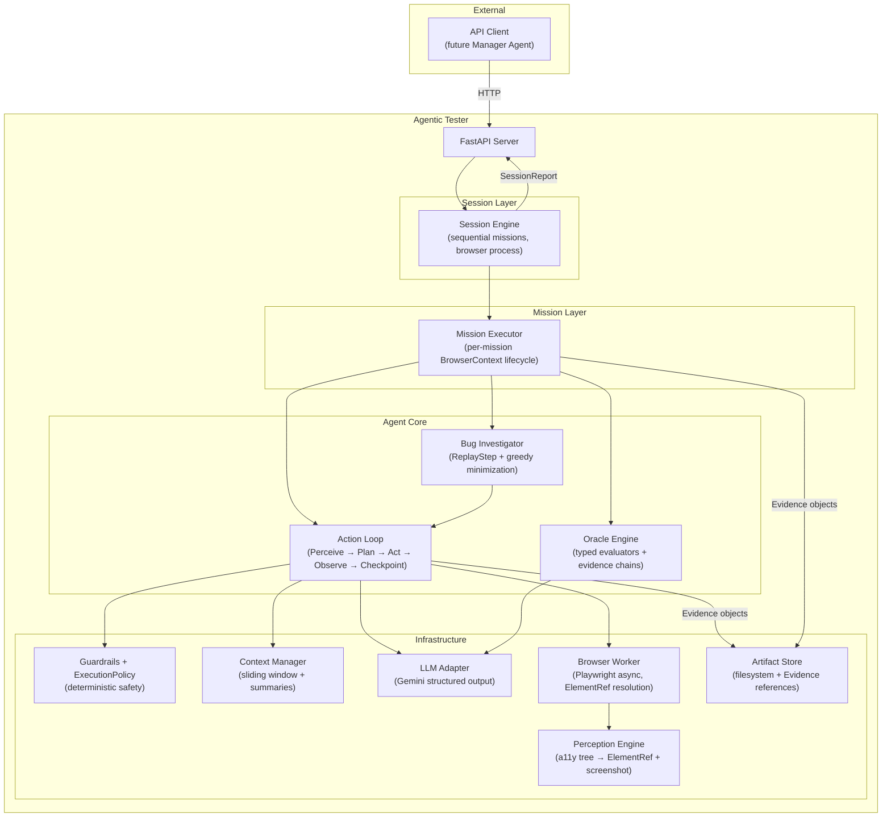
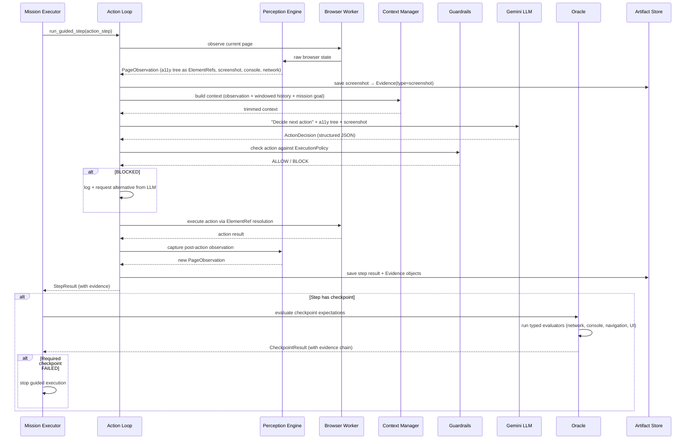
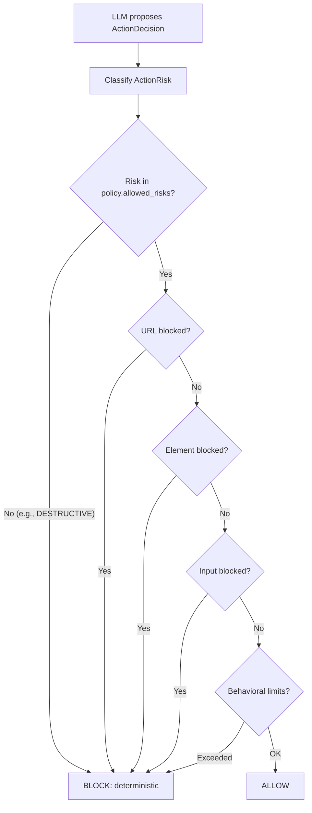

# Agentic Tester — Final Implementation Plan (POC)

Build a mission-driven, AI-assisted browser-testing agent that receives structured test missions, executes them against a live web application using Playwright, and produces machine-readable structured JSON reports with full Playwright trace artifacts and traceable evidence chains.

**Scope**: Proof of concept. No authentication flows. Sequential mission execution. Safety-constrained guided testing. Every verdict traceable to concrete evidence.

## POC Scope Decision — Guided Missions Only

The POC executes only the actions explicitly defined by each `TestMission`. It does
not generate unbounded actions or independently roam the application.

This keeps execution reproducible, makes safety review deterministic, reduces model
cost, and makes every failure attributable to a declared behavioral contract. Edge
cases remain supported, but any edge case that must be tested must be represented by
explicit `ActionStep` entries and, where useful, checkpoints.

---

## Design Decisions

| Decision | Choice | Rationale |
|----------|--------|-----------|
| Language | Python 3.12+ | Best LLM/AI ecosystem, async Playwright bindings |
| LLM (initial) | Google Gemini | Strong multimodal, long context, Pydantic schema support |
| LLM Design | Pluggable adapter | Extensible to OpenAI/Anthropic later |
| API | FastAPI (async) | Auto OpenAPI docs, native async, Pydantic integration |
| Browser | Playwright (async) | Cross-browser, auto-wait, tracing, a11y snapshots |
| Storage | File-system artifacts | Traces, screenshots, reports organized by session/mission |
| Execution | Sequential missions | One browser context at a time |
| Mission Isolation | Fresh BrowserContext per mission | Prevent state leakage |
| Auth | Not supported (POC) | Target apps assumed accessible without login |
| Safety | Deterministic ExecutionPolicy | No LLM in the safety loop |
| Evidence | First-class structured model | Every verdict traceable to concrete browser evidence |
| Assertions | Mid-execution checkpoints | Not just end-of-mission evaluation |

---

## Design Principles

```
Mission defines intent
Execution state defines what has happened
Actions change application state
Evidence records what actually happened
Oracle interprets evidence against the mission contract
```

The LLM may propose actions and interpretations, but:

```
Browser execution  = deterministic
Safety             = deterministic
Evidence capture   = deterministic
Objective checks   = deterministic
Semantic interpret = LLM-assisted
```

---

## Architecture Overview



---

## Data Flow: One Mission Step (with Checkpoint)



---

## Proposed Changes

## Token Efficiency Architecture — Implemented 2026-08-23

A real two-guided-step mission with deterministic bug investigation consumed
82,826 input tokens and 1,220 output tokens. The mission itself consumed 42,481
input tokens; the final session summary consumed the remaining approximately
40,345 input tokens. Screenshot bytes were not the dominant cause. The run saved
12 viewport PNGs totaling about 121 KiB; after bounded JPEG projection, each
model-facing image is small enough to occupy approximately one Gemini image tile.

The principal cost was repeated, full-fidelity domain serialization:

- `StepResult.evidence` duplicated ARIA trees, visible text, URLs, screenshots,
  console entries, and network entries before and after every action.
- Ten deterministic replay steps accumulated evidence even though replay does
  not consult the LLM.
- Bug investigation passed the cumulative replay evidence to anomaly assessment
  and the complete action-loop history to reproduction extraction.
- The session summary serialized the entire `MissionResult`, including steps,
  checkpoint evidence, bug evidence, and a second `all_evidence` collection. The
  saved mission JSON was about 100,510 characters; `all_evidence` alone was about
  46,010 characters across 94 evidence objects.
- Planning and oracle prompts used pretty-printed JSON and overlapping page
  representations, including both mapped ARIA and raw Playwright ARIA text.

The implementation now separates durable artifacts from model-facing
projections. Evidence remains complete on disk; only compact, purpose-built views
are sent to the model:

1. **Observation projection** sends URL, title, state fingerprint, mapped ARIA
   tree, interactive element references, bounded visible text, and new
   console/network facts. It removes raw duplicate ARIA text, timestamps,
   screenshot paths, internal locators, response bodies, and evidence envelopes.
2. **History projection** sends only step index, identifier, compact action,
   action type, completed/blocked/error status, resulting URL, and error. It
   never sends evidence arrays, UUIDs, timestamps, durations, or model reasoning.
3. **Evidence projection** sends only the evidence ID, type, source, and bounded
   excerpt when a model must cite evidence. Persisted evidence retains every
   field.
4. **Investigation projection** uses evidence from the latest replay attempt for
   anomaly assessment, not evidence accumulated across reproduction and
   minimization attempts. Reproduction extraction receives compact step records,
   not full `StepResult` objects.
5. **Replay isolation** persists replay results and evidence for reports but does
   not add them to the guided-action `ContextManager`.
6. **Session-summary projection** sends mission status, goal, verdict, compact
   step/checkpoint/final-evaluation facts, anomaly strings, and compact bug
   descriptions. It omits duplicated evidence collections, artifact paths, token
   accounting, timestamps, UUIDs, and nested evidence.
7. **Image policy** defaults to oracle/anomaly calls only. Planning is semantic
   and ARIA/ref-driven unless `TESTER_OBSERVATION_IMAGE_MODE=always` is set;
   images can be disabled with `off`. Original PNG evidence is unchanged.
8. **Prompt serialization** uses compact JSON and records call purpose, prompt
   size, image presence, and image size with token usage.

Configuration defaults are intentionally conservative but editable:

```env
TESTER_OBSERVATION_IMAGE_MODE=oracle
TESTER_OBSERVATION_IMAGE_MAX_SIDE=512
TESTER_OBSERVATION_IMAGE_QUALITY=60
TESTER_OBSERVATION_TREE_MAX_CHARS=6000
TESTER_OBSERVATION_TEXT_MAX_CHARS=1200
TESTER_LLM_EVIDENCE_EXCERPT_MAX_CHARS=300
TESTER_LLM_MAX_EVIDENCE_ITEMS=12
TESTER_CONTEXT_WINDOW_SIZE=3
```

The intended effect is to preserve evidence-backed reports and deterministic
replay while reducing this workload from roughly 83k input tokens to a compact
semantic context measured in thousands rather than tens of thousands of tokens.

### Phase 0 — Project Scaffolding

---

#### [NEW] `pyproject.toml`

```toml
[project]
name = "agentic-tester"
version = "0.1.0"
requires-python = ">=3.12"
dependencies = [
    "fastapi>=0.115",
    "uvicorn[standard]>=0.30",
    "playwright>=1.48",
    "google-genai>=1.0",
    "pydantic>=2.9",
    "pydantic-settings>=2.6",
    "structlog>=24.4",
    "httpx>=0.28",
]

[project.optional-dependencies]
dev = [
    "pytest>=8.3",
    "pytest-asyncio>=0.24",
    "ruff>=0.8",
    "mypy>=1.13",
]

[project.scripts]
agentic-tester = "agentic_tester.main:main"
```

#### [NEW] `.env.example`

```env
GEMINI_API_KEY=your-key-here
TESTER_HOST=0.0.0.0
TESTER_PORT=8000
TESTER_ARTIFACT_DIR=./artifacts
TESTER_LOG_LEVEL=INFO
TESTER_HEADLESS=true
```

#### [NEW] `Makefile`, `.gitignore`, `README.md`

Standard tooling: `make install` (pip + playwright), `make dev` (uvicorn), `make test`, `make lint`.

---

### Phase 1 — Configuration

---

#### [NEW] `src/agentic_tester/config.py`

```python
class Settings(BaseSettings):
    model_config = SettingsConfigDict(env_file=".env", env_prefix="TESTER_")

    # LLM
    llm_provider: Literal["gemini"] = "gemini"
    gemini_api_key: str = ""
    llm_model: str = "gemini-3.6-flash"
    llm_temperature: float = 0.2

    # Browser
    browser_type: Literal["chromium", "firefox", "webkit"] = "chromium"
    headless: bool = True
    viewport_width: int = 1280
    viewport_height: int = 720
    default_timeout_ms: int = 30000
    slow_mo_ms: int = 0

    # Server
    host: str = "0.0.0.0"
    port: int = 8000

    # Artifacts
    artifact_dir: Path = Path("./artifacts")

    # Agent behavior
    max_actions_per_mission: int = 50
    max_retries_per_action: int = 3
    max_minimization_attempts: int = 20   # Greedy deletion budget

    # Context management
    context_window_size: int = 10

    # Logging
    log_level: str = "INFO"
```

---

### Phase 2 — Domain Models

All data structures flowing through the system. This is where all the major critique integrations happen.

---

#### [NEW] `src/agentic_tester/models/evidence.py`

**Evidence as a first-class domain object.** Every observation, assertion result, and bug report traces back to concrete evidence.

```python
class EvidenceType(str, Enum):
    SCREENSHOT = "screenshot"
    ACCESSIBILITY = "accessibility"
    CONSOLE = "console"
    NETWORK = "network"
    URL = "url"
    BROWSER_STATE = "browser_state"
    ACTION = "action"
    TRACE = "trace"
    TEXT = "text"

class Evidence(BaseModel):
    """A single piece of concrete browser evidence."""
    evidence_id: str                          # UUID
    type: EvidenceType
    source: str                               # What produced this: "perception", "oracle", "action_loop"
    step_index: int | None = None             # Which step captured this
    timestamp: datetime
    artifact_path: str | None = None          # Relative path in ArtifactStore
    excerpt: str | None = None                # Inline summary/excerpt
    metadata: dict[str, Any] = {}             # Type-specific data

    # Type-specific metadata examples:
    # screenshot: {"width": 1280, "height": 720}
    # network:    {"method": "POST", "url": "/api/projects", "status": 201}
    # console:    {"level": "error", "text": "Uncaught TypeError..."}
    # url:        {"url": "http://localhost:3000/projects/42"}
    # text:       {"content": "Project created successfully"}
```

**Why this matters**: The Manager Agent will consume reports programmatically. It needs to trace "why did the oracle say FAIL?" to specific, typed evidence — not parse LLM reasoning strings.

---

#### [NEW] `src/agentic_tester/models/mission.py`

Mission schema with **inline checkpoints** on action steps:

```python
class ExpectedBehavior(BaseModel):
    """A behavioral assertion to verify."""
    expectation_id: str                   # Unique ID for evidence linking
    description: str                      # "Success toast appears"
    type: Literal["ui", "navigation", "state", "error_absence", "network"]
    severity: Literal["must", "should", "may"]

class Checkpoint(BaseModel):
    """Assertions evaluated immediately after an action step."""
    description: str                      # "Save succeeded"
    expectations: list[ExpectedBehavior]
    invariants: list[str] = []            # Additional invariants to check
    required: bool = True                 # If True, failure stops the mission
    continue_on_failure: bool = False     # If True, log failure but continue

class ActionStep(BaseModel):
    """A single guided step with optional mid-execution checkpoint."""
    step_id: str                          # Unique ID
    description: str                      # "Click the 'Save' button"
    selector_hint: str | None = None      # Optional CSS/aria hint
    input_data: dict[str, Any] = {}       # Data to type/select
    checkpoint: Checkpoint | None = None  # Evaluate after this step

class TestMission(BaseModel):
    """A single testing mission with behavioral contract."""
    mission_id: str
    goal: str
    priority: Literal["critical", "high", "medium", "low"] = "medium"
    target_url: str

    # What to do
    actions: list[ActionStep]

    # Final assertions (evaluated after all guided steps complete)
    expected_behaviors: list[ExpectedBehavior]
    invariants: list[str]

    # Edge cases must be represented by explicit ActionStep entries when they
    # are required to run; this field is descriptive mission metadata only.
    edge_cases: list[str]

    # Metadata
    tags: list[str]
    related_routes: list[str]
```

**Execution semantics:**

```
action step 1 → checkpoint 1 (if present) → action step 2 → checkpoint 2 → ...
                                                                               ↓
                                              ... → final expected_behaviors evaluation
```

A required checkpoint failure stops the guided flow. The mission immediately goes to verdict compilation (skipping remaining steps).

---

#### [NEW] `src/agentic_tester/models/element.py`

**Agent-owned element identity**, decoupled from Playwright internals:

```python
class ElementRef(BaseModel):
    """Agent-owned element identity. The LLM refers to elements by `id`,
    never by Playwright-specific selectors."""
    id: str                               # "el_17" (tester-owned ID)
    role: str                             # "button", "textbox", "link"
    name: str                             # Accessible name
    locator_value: str                    # Underlying Playwright locator value
    is_enabled: bool = True
    value: str | None = None              # Current value for inputs
```

The perception engine produces `ElementRef` objects from the a11y snapshot. The LLM chooses elements by `id`. The browser worker resolves `ElementRef.locator_value` back to a Playwright locator.

---

#### [NEW] `src/agentic_tester/models/observation.py`

What the agent "sees" at each step:

```python
class ConsoleEntry(BaseModel):
    level: Literal["log", "warn", "error", "info", "debug"]
    text: str
    timestamp: datetime

class NetworkEntry(BaseModel):
    method: str
    url: str
    status: int | None
    response_body_preview: str | None     # First 500 chars
    duration_ms: int | None
    is_failure: bool                      # 4xx/5xx or network error

class PageObservation(BaseModel):
    """Complete snapshot of the page state at a point in time."""
    url: str
    title: str
    screenshot_path: str                  # Relative path in artifact store
    accessibility_tree: str               # YAML-format a11y snapshot
    interactive_elements: list[ElementRef]
    visible_text_summary: str             # Truncated (2000 chars)
    console_entries: list[ConsoleEntry]   # Since last observation
    network_log: list[NetworkEntry]       # Since last observation
    state_fingerprint: str                # Hash for replay start-state verification
    timestamp: datetime
```

**Perception strategy:**

1. **Accessibility tree as primary input** — 10-50x smaller than DOM, token-efficient, contains `ref` IDs mapped to our `ElementRef.id`
2. **Screenshot as secondary visual input** — sent to Gemini for layout/color/visual checks
3. **Console + network as objective signals** — used directly by oracle, not through LLM
4. **State fingerprint** — hash of (URL + sorted element names) for replay start-state verification

---

#### [NEW] `src/agentic_tester/models/safety.py`

**Deterministic safety policy** — no LLM in the safety loop:

```python
class ActionRisk(str, Enum):
    """Risk classification for browser actions."""
    READ = "read"                                     # Viewing, scrolling
    NAVIGATION = "navigation"                         # Clicking links, back/forward
    NON_DESTRUCTIVE_MUTATION = "non_destructive_mutation"  # Filling forms, toggling
    DESTRUCTIVE_MUTATION = "destructive_mutation"          # Delete, remove, cancel
    EXTERNAL_SIDE_EFFECT = "external_side_effect"          # Payments, emails

class ExecutionPolicy(BaseModel):
    """Deterministic execution boundary. Defines what the tester is allowed to do."""
    allowed_risks: set[ActionRisk] = {
        ActionRisk.READ,
        ActionRisk.NAVIGATION,
        ActionRisk.NON_DESTRUCTIVE_MUTATION,
    }
    # DESTRUCTIVE_MUTATION and EXTERNAL_SIDE_EFFECT are BLOCKED by default

    # Domain constraints
    allowed_url_patterns: list[str] = ["*"]
    blocked_url_patterns: list[str] = [
        "**/admin/delete*", "**/api/*/destroy*", "**/account/delete*",
        "**/billing*", "**/payment*", "**/checkout*",
    ]

    # Element constraints — patterns matching element names
    blocked_element_patterns: list[str] = [
        "*delete*account*", "*remove*all*", "*drop*database*",
        "*factory*reset*", "*erase*", "*permanently*delete*",
        "*cancel*subscription*", "*close*account*",
    ]

    # Input constraints
    blocked_input_patterns: list[str] = [
        "DROP TABLE*", "<script>*", "rm -rf*",
    ]

    # Behavioral limits
    max_consecutive_errors: int = 5
    max_same_action_repeats: int = 3
    allow_file_downloads: bool = False
    allow_new_tabs: bool = False
    allow_navigation_away: bool = False

    # Risk classification patterns — how to classify an action's risk
    destructive_patterns: list[str] = [
        "*delete*", "*remove*", "*destroy*", "*drop*",
        "*cancel*", "*revoke*", "*terminate*",
    ]
    side_effect_patterns: list[str] = [
        "*payment*", "*purchase*", "*subscribe*",
        "*send*email*", "*send*invite*",
    ]
```

**How risk classification works:**

```
ActionDecision proposed by LLM
  ↓
Classify risk:
  - action_type == SCROLL/WAIT → READ
  - action_type == NAVIGATE/GO_BACK → NAVIGATION
  - element name matches destructive_patterns → DESTRUCTIVE_MUTATION
  - element name matches side_effect_patterns → EXTERNAL_SIDE_EFFECT
  - default → NON_DESTRUCTIVE_MUTATION
  ↓
Check risk against policy.allowed_risks
  ↓
ALLOW or BLOCK (deterministic, no LLM)
```

---

#### [NEW] `src/agentic_tester/models/results.py`

All result models now carry **evidence chains**:

```python
class StepResult(BaseModel):
    """Result of a single action step."""
    step_index: int
    step_id: str | None = None            # From ActionStep.step_id
    action_taken: str                     # "click el_17 (button 'Submit')"
    action_type: str
    reasoning: str                        # LLM's reasoning
    evidence: list[Evidence]              # All evidence from this step
    page_url_before: str
    page_url_after: str
    duration_ms: int
    timestamp: datetime
    was_blocked: bool = False
    block_reason: str | None = None
    error: str | None = None

class CheckpointResult(BaseModel):
    """Result of evaluating a mid-execution checkpoint."""
    checkpoint_description: str
    passed: bool
    required: bool
    expectation_evaluations: list[ExpectationEvaluation]
    invariant_violations: list[str]
    evidence: list[Evidence]

class ExpectationEvaluation(BaseModel):
    """Oracle's verdict on a single expected behavior, with evidence chain."""
    expectation_id: str
    description: str
    severity: Literal["must", "should", "may"]
    verdict: Literal["pass", "fail", "uncertain", "skip"]
    confidence: float                     # 0.0 - 1.0
    explanation: str                      # Why the oracle reached this verdict
    evidence_ids: list[str]               # References to Evidence objects
    evaluator_type: str                   # "network", "console", "navigation", "ui", "text"

class ReplayStep(BaseModel):
    """An executable action record for deterministic reproduction."""
    action_type: str                      # ActionType value
    element_ref: ElementRef | None
    value: str | None
    key: str | None = None
    expected_state_fingerprint: str | None  # Verify correct starting state

class BugReport(BaseModel):
    """A confirmed or suspected bug with evidence chain."""
    bug_id: str
    title: str
    severity: Literal["critical", "major", "minor", "cosmetic"]
    description: str
    expected_behavior: str
    actual_behavior: str
    reproduction_steps: list[ReplayStep]  # Deterministic, executable
    reproduction_steps_readable: list[str] # Human-readable version
    reproduction_success_rate: str        # "3/3"
    evidence: list[Evidence]              # All supporting evidence
    confidence: float

class TokenUsage(BaseModel):
    input_tokens: int = 0
    output_tokens: int = 0
    total_tokens: int = 0

class ArtifactPaths(BaseModel):
    trace_path: str | None = None
    screenshots_dir: str
    report_path: str

class MissionResult(BaseModel):
    """Complete result of executing one mission."""
    mission_id: str
    goal: str
    status: Literal["passed", "failed", "uncertain", "error"]
    verdict_reasoning: str
    steps: list[StepResult]
    checkpoint_results: list[CheckpointResult]
    final_evaluations: list[ExpectationEvaluation]
    invariant_violations: list[str]
    anomalies: list[str]
    bugs: list[BugReport]
    all_evidence: list[Evidence]           # Deduplicated master evidence list
    duration_ms: int
    token_usage: TokenUsage
    artifacts: ArtifactPaths

class SessionReport(BaseModel):
    """Complete report for an entire test session."""
    session_id: str
    target_base_url: str
    overall_status: Literal["passed", "failed", "mixed", "error"]
    summary: str
    mission_results: list[MissionResult]
    total_bugs: int
    total_duration_ms: int
    total_token_usage: TokenUsage
    artifact_root: str
    completed_at: datetime
```

---

#### [NEW] `src/agentic_tester/models/session.py`

```python
class TestSession(BaseModel):
    session_id: str
    target_base_url: str
    missions: list[TestMission]
    execution_policy: ExecutionPolicy = ExecutionPolicy()
    config_overrides: dict[str, Any] = {}
    status: Literal["pending", "running", "completed", "failed", "cancelled"]
    created_at: datetime
    started_at: datetime | None = None
    completed_at: datetime | None = None
```

---

#### [NEW] `src/agentic_tester/models/state.py`

**State fingerprinting for replay verification:**

```python
import hashlib

class StateFingerprint:
    """Deterministic hash of observable browser state for replay verification."""

    @staticmethod
    def compute(url: str, element_names: list[str]) -> str:
        """Hash of URL + sorted interactive element names."""
        normalized = sorted(set(element_names))
        content = f"{url}|{'|'.join(normalized)}"
        return hashlib.sha256(content.encode()).hexdigest()[:16]
```

---

### Phase 3 — LLM Adapter Layer

---

#### [NEW] `src/agentic_tester/llm/base.py`

Abstract interface — every method returns structured Pydantic output:

```python
class LLMAdapter(ABC):
    @abstractmethod
    async def plan_next_action(
        self,
        observation: PageObservation,
        mission_context: MissionContext,
        history_summary: str,
        recent_steps: list[StepResult],
    ) -> ActionDecision: ...

    @abstractmethod
    async def evaluate_behavior(
        self,
        observation: PageObservation,
        expected: ExpectedBehavior,
        relevant_evidence: list[Evidence],
    ) -> BehaviorVerdict: ...

    @abstractmethod
    @abstractmethod
    async def assess_anomaly(
        self,
        anomaly_description: str,
        observation: PageObservation,
        relevant_evidence: list[Evidence],
    ) -> AnomalyAssessment: ...

    @abstractmethod
    async def extract_reproduction_steps(
        self,
        anomaly: str,
        step_history: list[StepResult],
    ) -> list[str]: ...

    @abstractmethod
    async def summarize_history(
        self, steps: list[StepResult],
    ) -> str: ...

    @abstractmethod
    async def generate_session_summary(
        self, mission_results: list[MissionResult],
    ) -> str: ...
```

---

#### [NEW] `src/agentic_tester/llm/gemini_adapter.py`

Gemini implementation using `google-genai` with structured output:

- **Multimodal input**: a11y tree (text) + screenshot (vision) on every action-planning call
- **Structured output**: `response_schema=ActionDecision` ensures valid JSON
- **Token tracking**: updates `TokenUsage` from `response.usage_metadata`
- **Retry with backoff**: exponential backoff for rate limits

#### [NEW] `src/agentic_tester/llm/prompts.py`

All prompt constants. Key prompts:

- `PLAN_ACTION_PROMPT`: "You are a QA tester. Given the page state and mission goal, decide the next action. Use element IDs from the element list."
- `EVALUATE_BEHAVIOR_PROMPT`: "Evaluate whether this expected behavior occurred. Cite specific evidence."
- `SUMMARIZE_HISTORY_PROMPT`: "Summarize this test execution history concisely."
- `EXTRACT_REPRODUCTION_PROMPT`: "Given this anomaly and step history, extract the minimal sequence of steps that would reproduce the issue."

#### [NEW] `src/agentic_tester/llm/factory.py`

```python
def create_llm_adapter(settings: Settings) -> LLMAdapter:
    if settings.llm_provider == "gemini":
        return GeminiAdapter(settings)
    raise ValueError(f"Unsupported: {settings.llm_provider}")
```

---

### Phase 4 — Browser Worker & Perception Engine

The browser worker now manages **per-mission BrowserContext lifecycle** and resolves **ElementRef** identities.

---

#### [NEW] `src/agentic_tester/browser/worker.py`

```python
class BrowserWorker:
    """Controls a Playwright browser. Manages per-mission context lifecycle."""

    # --- Lifecycle (session-level: browser process) ---
    async def start_browser(self, settings: Settings) -> None:
        """Launch Playwright and browser process. Called once per session."""

    async def stop_browser(self) -> None:
        """Close browser process. Called once per session."""

    # --- Lifecycle (mission-level: browser context) ---
    async def create_context(self, settings: Settings) -> None:
        """Create a fresh BrowserContext + Page.
        Start tracing. Attach console/network listeners.
        Called once per mission — ensures mission isolation."""

    async def close_context(self, trace_output_path: Path) -> None:
        """Stop tracing (save trace.zip). Close context.
        Called at end of mission — disposes all state."""

    # --- Actions (resolve ElementRef → Playwright locator) ---
    async def navigate(self, url: str) -> None: ...
    async def click(self, element: ElementRef) -> None:
        """Resolve ElementRef.locator_value → Playwright locator, then click."""
    async def fill(self, element: ElementRef, value: str) -> None: ...
    async def select_option(self, element: ElementRef, value: str) -> None: ...
    async def press_key(self, key: str) -> None: ...
    async def scroll(self, direction: Literal["up", "down"], pixels: int = 300) -> None: ...
    async def hover(self, element: ElementRef) -> None: ...
    async def go_back(self) -> None: ...
    async def go_forward(self) -> None: ...
    async def refresh(self) -> None: ...
    async def wait(self, ms: int) -> None: ...

    async def execute_action(self, decision: ActionDecision,
                             elements: list[ElementRef]) -> str | None:
        """Route ActionDecision to correct method.
        Looks up decision.ref in the elements list to find ElementRef.
        Returns error string or None on success."""

    # --- Observation ---
    async def get_page_url(self) -> str: ...
    async def get_page_title(self) -> str: ...
    async def take_screenshot(self, save_path: Path) -> bytes: ...
    async def get_accessibility_snapshot(self) -> dict: ...
    async def get_console_entries(self) -> list[ConsoleEntry]:
        """Drain buffer — returns entries since last call."""
    async def get_network_entries(self) -> list[NetworkEntry]:
        """Drain buffer — returns entries since last call."""
```

**Mission isolation**: The session engine calls `create_context()` before each mission and `close_context()` after. This gives each mission:
- Fresh cookies/localStorage/sessionStorage
- Independent Playwright trace
- Clean console/network buffers
- No state leakage from previous missions

**Failure isolation**: If a mission crashes the context, the browser process survives. The session engine can create a fresh context for the next mission.

---

#### [NEW] `src/agentic_tester/browser/perception.py`

Transforms raw browser state into `PageObservation` with `ElementRef` mapping:

```python
class PerceptionEngine:
    """Builds PageObservation from browser state. Maps a11y refs to ElementRefs."""

    def __init__(self):
        self._element_counter = 0

    async def capture(self, browser: BrowserWorker, artifact_store: ArtifactStore,
                      session_id: str, mission_id: str, step_index: int) -> PageObservation:
        """
        1. Take screenshot → save → create Evidence(type=screenshot)
        2. Get a11y snapshot → map to ElementRef list + YAML string
        3. Extract visible text summary
        4. Drain console/network buffers
        5. Compute state fingerprint
        6. Build PageObservation
        """

    def map_to_element_refs(self, a11y_snapshot: dict) -> tuple[list[ElementRef], str]:
        """Walk a11y tree. For each interactive element:
        - Assign stable tester-owned ID (el_0, el_1, ...)
        - Create ElementRef with role, name, locator_value
        - Build YAML representation using our IDs

        Returns (element_refs, yaml_string_for_llm)
        """

    def reset_counter(self) -> None:
        """Reset element counter for new perception cycle."""
```

**YAML output sent to LLM** (using our IDs, not Playwright's):

```yaml
- heading "My App" [level=1]
- navigation "Main":
  - link "Home" [el_0]
  - link "Dashboard" [el_1]
- main:
  - textbox "Email" [el_2]
  - textbox "Password" [el_3]
  - button "Sign In" [el_4]
```

The LLM refers to `el_4`. We look up `ElementRef(id="el_4")` to get the Playwright locator.

---

### Phase 5 — Context Manager

No changes from previous plan. Sliding window + rolling LLM summary.

---

#### [NEW] `src/agentic_tester/agent/context_manager.py`

```python
class ContextManager:
    """Sliding window + rolling summary to keep LLM context token-efficient."""

    def __init__(self, window_size: int = 10, llm: LLMAdapter | None = None):
        self._full_history: list[StepResult] = []
        self._summary: str = ""
        self._window_size = window_size
        self._llm = llm

    def add_step(self, step: StepResult) -> None: ...

    async def get_context(self) -> tuple[str, list[StepResult]]:
        """Returns (summary_of_old_steps, recent_steps_in_full_detail)."""

    def get_full_history(self) -> list[StepResult]: ...
    def reset(self) -> None: ...
```

---

### Phase 6 — Action Space & Guardrails (Deterministic Safety)

---

#### [NEW] `src/agentic_tester/agent/action_space.py`

```python
class ActionType(str, Enum):
    CLICK = "click"
    FILL = "fill"
    SELECT_OPTION = "select_option"
    PRESS_KEY = "press_key"
    SCROLL = "scroll"
    NAVIGATE = "navigate"
    HOVER = "hover"
    GO_BACK = "go_back"
    GO_FORWARD = "go_forward"
    REFRESH = "refresh"
    WAIT = "wait"
    DONE = "done"
    STUCK = "stuck"

class ActionDecision(BaseModel):
    """LLM's chosen next action."""
    action_type: ActionType
    ref: str | None = None          # ElementRef.id (e.g., "el_4")
    value: str | None = None
    key: str | None = None
    reasoning: str
    confidence: float
    expected_result: str
```

---

#### [NEW] `src/agentic_tester/agent/guardrails.py`

**Fully deterministic safety — no LLM in the loop:**

```python
class GuardrailsEngine:
    """Deterministic pre-action safety filter based on ExecutionPolicy."""

    def __init__(self, policy: ExecutionPolicy):
        self._policy = policy
        self._consecutive_errors = 0
        self._action_counts: dict[str, int] = {}

    def check(
        self, action: ActionDecision, current_url: str,
        element: ElementRef | None, target_base_url: str
    ) -> GuardrailResult:
        """
        Deterministic evaluation:
        1. Classify action risk (READ / NAVIGATION / MUTATION / DESTRUCTIVE / SIDE_EFFECT)
        2. Check risk against policy.allowed_risks
        3. Check URL against blocked_url_patterns
        4. Check element name against blocked_element_patterns
        5. Check input value against blocked_input_patterns
        6. Check behavioral limits (repetition, consecutive errors)
        7. Check domain boundaries (allow_navigation_away)

        Returns ALLOW or BLOCK with reason. No LLM consultation.
        """

    def classify_risk(self, action: ActionDecision, element: ElementRef | None) -> ActionRisk:
        """
        Deterministic risk classification:
        - SCROLL, WAIT → READ
        - NAVIGATE, GO_BACK, GO_FORWARD, REFRESH → NAVIGATION
        - Element name matches destructive_patterns → DESTRUCTIVE_MUTATION
        - Element name matches side_effect_patterns → EXTERNAL_SIDE_EFFECT
        - CLICK, FILL, SELECT, HOVER (not matching above) → NON_DESTRUCTIVE_MUTATION
        """

    def record_error(self) -> bool: ...
    def record_success(self) -> None: ...

class GuardrailResult(BaseModel):
    allowed: bool
    reason: str | None = None
    risk_level: ActionRisk | None = None
```

**Safety flow:**



No LLM double-check anywhere. Safety is code, not conversation.

---

### Phase 7 — Artifact Store

---

#### [NEW] `src/agentic_tester/artifacts/store.py`

```python
class ArtifactStore:
    """File-system artifact storage. Evidence objects reference artifacts by path."""

    def __init__(self, base_dir: Path): ...

    def get_session_dir(self, session_id: str) -> Path: ...
    def get_mission_dir(self, session_id: str, mission_id: str) -> Path: ...
    def get_step_dir(self, session_id: str, mission_id: str, step_index: int) -> Path: ...

    async def save_screenshot(self, session_id, mission_id, step_index, data: bytes) -> str: ...
    async def save_step_result(self, session_id, mission_id, step: StepResult) -> str: ...
    async def save_mission_result(self, session_id, result: MissionResult) -> str: ...
    async def save_session_report(self, report: SessionReport) -> str: ...
    async def save_trace(self, session_id, mission_id, trace_path: Path) -> str: ...

    def create_evidence(
        self, type: EvidenceType, source: str, step_index: int | None,
        artifact_path: str | None = None, excerpt: str | None = None,
        **metadata
    ) -> Evidence:
        """Factory method to create Evidence with auto-generated ID and timestamp."""
```

**Directory structure** (per-mission traces for isolation):

```
artifacts/
└── sessions/
    └── {session_id}/
        ├── report.json
        └── missions/
            ├── {mission_id_1}/
            │   ├── trace.zip              # Per-mission Playwright trace
            │   ├── mission_result.json
            │   ├── steps/
            │   │   ├── 0000/
            │   │   │   ├── screenshot.png
            │   │   │   └── step_result.json
            │   │   └── ...
            └── {mission_id_2}/
                ├── trace.zip
                └── ...
```

---

### Phase 8 — Core Action Loop (Checkpoint-Aware)

---

#### [NEW] `src/agentic_tester/agent/action_loop.py`

The action loop now **collects Evidence objects** at every step and supports **checkpoint evaluation**:

```python
class ActionLoop:
    """Perceive → Plan → Act → Observe. Collects evidence at every step."""

    def __init__(
        self, llm: LLMAdapter, browser: BrowserWorker, perception: PerceptionEngine,
        guardrails: GuardrailsEngine, context_mgr: ContextManager,
        artifact_store: ArtifactStore, settings: Settings
    ): ...

    async def run_guided_step(
        self, step: ActionStep, mission_context: MissionContext, step_index: int
    ) -> StepResult:
        """
        1. Perceive → PageObservation
        2. Create Evidence(type=screenshot, accessibility, url)
        3. Build LLM context: "Next step: '{step.description}'"
        4. LLM → ActionDecision
        5. Guardrails check (deterministic)
        6. If BLOCKED: log, request alternative from LLM
        7. Execute action via BrowserWorker (with ElementRef resolution)
        8. Handle retry on failure (_execute_with_retry)
        9. Perceive result → new PageObservation
        10. Collect console/network Evidence
        11. Record ReplayStep for reproduction
        12. Return StepResult with all Evidence
        """

    async def replay_step(self, replay: ReplayStep, step_index: int) -> StepResult:
        """Execute a deterministic ReplayStep for bug reproduction.
        No LLM involved — directly execute the recorded action."""

    async def _execute_with_retry(
        self, action: ActionDecision, elements: list[ElementRef],
        step_description: str, max_retries: int = 3
    ) -> tuple[str | None, PageObservation]:
        """
        On failure:
        1. Capture error
        2. Re-perceive (page may have changed)
        3. Send error + new page to LLM for corrected action
        4. Retry
        """
```

---

### Phase 9 — Oracle Engine (Typed Evaluators + Evidence Chains)

---

#### [NEW] `src/agentic_tester/engine/oracle.py`

The oracle now uses **typed evaluators** and returns **evidence-linked evaluations**:

```python
class OracleEngine:
    """Multi-signal behavioral verification with typed evaluators."""

    def __init__(self, llm: LLMAdapter, artifact_store: ArtifactStore): ...

    async def evaluate_expectation(
        self, expected: ExpectedBehavior, observation: PageObservation,
        recent_steps: list[StepResult],
    ) -> ExpectationEvaluation:
        """
        Route to typed evaluator based on expected.type:
          "network"        → NetworkEvaluator  (deterministic)
          "error_absence"  → ConsoleEvaluator  (deterministic)
          "navigation"     → NavigationEvaluator (deterministic)
          "ui"             → UIEvaluator (LLM-assisted)
          "state"          → StateEvaluator (LLM-assisted)

        Each evaluator:
        1. Collects relevant evidence
        2. Applies evaluation logic
        3. Returns ExpectationEvaluation with evidence_ids
        """

    async def evaluate_checkpoint(
        self, checkpoint: Checkpoint, observation: PageObservation,
        recent_steps: list[StepResult],
    ) -> CheckpointResult:
        """Evaluate all expectations in a checkpoint. Check invariants."""

    async def evaluate_final(
        self, expectations: list[ExpectedBehavior], observation: PageObservation,
        all_steps: list[StepResult],
    ) -> list[ExpectationEvaluation]:
        """Evaluate end-of-mission expected behaviors."""

    async def check_invariants(
        self, invariants: list[str], observation: PageObservation
    ) -> list[str]:
        """Check invariants. Returns violated invariant descriptions.
        Common ones handled deterministically:
          'No console errors'     → scan console_entries
          'No 500 errors'         → scan network_log
          'Page loaded'           → check title not empty
        Others → LLM evaluation."""

    async def detect_anomalies(
        self, observation: PageObservation, recent_steps: list[StepResult]
    ) -> list[str]:
        """Proactive anomaly scan (all deterministic):
        - Console errors
        - Failed network requests (4xx/5xx)
        - Blank page
        - Unexpected navigation"""

    # --- Typed evaluators (private methods) ---

    def _evaluate_network(self, expected: ExpectedBehavior,
                          network_log: list[NetworkEntry]) -> ExpectationEvaluation:
        """Deterministic: check network log for expected API calls/statuses.
        E.g., 'POST /api/projects returns 201' → scan for matching entry."""

    def _evaluate_console(self, expected: ExpectedBehavior,
                          console: list[ConsoleEntry]) -> ExpectationEvaluation:
        """Deterministic: check console for absence of errors."""

    def _evaluate_navigation(self, expected: ExpectedBehavior,
                             url: str) -> ExpectationEvaluation:
        """Deterministic: check URL matches expected pattern."""

    async def _evaluate_ui(self, expected: ExpectedBehavior,
                           observation: PageObservation,
                           evidence: list[Evidence]) -> ExpectationEvaluation:
        """LLM-assisted: send screenshot + a11y tree + expectation to LLM."""

    async def _evaluate_state(self, expected: ExpectedBehavior,
                              observation: PageObservation,
                              evidence: list[Evidence]) -> ExpectationEvaluation:
        """LLM-assisted: evaluate application state via visual/semantic analysis."""
```

**Evaluation priority (from the critique):**

```
1. Direct deterministic match     → PASS with high confidence
2. Deterministic contradiction    → FAIL with high confidence
3. Semantic/visual interpretation → LLM verdict with medium confidence
4. Conflict resolution            → lower confidence
5. UNCERTAIN when evidence is insufficient
```

---

### Phase 10 — Mission Executor (Checkpoint-Aware, Isolated)

---

#### [NEW] `src/agentic_tester/engine/mission_executor.py`

```python
class MissionExecutor:
    """Executes a single TestMission within its own isolated BrowserContext."""

    def __init__(self, llm, browser, perception, oracle,
                 investigator, guardrails, artifact_store, settings): ...

    async def execute(self, mission: TestMission, session_id: str) -> MissionResult:
        """
        Mission lifecycle (within an isolated BrowserContext):

        ┌──────────────────────────────────────────────────┐
        │ 1. NAVIGATE to mission.target_url                │
        ├──────────────────────────────────────────────────┤
        │ 2. GUIDED EXECUTION WITH CHECKPOINTS             │
        │    For each action step:                         │
        │      run_guided_step(step) → StepResult          │
        │      record ReplayStep                           │
        │      if step.checkpoint:                         │
        │        oracle.evaluate_checkpoint()              │
        │        if required checkpoint FAILED:            │
        │          → stop guided execution                 │
        │          → skip to verdict compilation           │
        ├──────────────────────────────────────────────────┤
        │ 3. FINAL BEHAVIOR EVALUATION                     │
        │    oracle.evaluate_final(expected_behaviors)     │
        │    oracle.check_invariants()                     │
        │    oracle.detect_anomalies()                     │
        ├──────────────────────────────────────────────────┤
        │ 4. BUG INVESTIGATION (if anomalies found)        │
        │    For each anomaly:                             │
        │      investigator.investigate()                  │
        ├──────────────────────────────────────────────────┤
        │ 5. COMPILE RESULT                                │
        │    Aggregate evidence, checks, and bugs          │
        │    Determine overall status                      │
        │    Save all artifacts                            │
        └──────────────────────────────────────────────────┘
        """

    def _determine_status(self, checkpoint_results, final_evaluations,
                          bugs, invariant_violations) -> str:
        """
        Decision logic:
        - Any required checkpoint FAILED → "failed"
        - Any 'must' final behavior FAILED → "failed"
        - Any critical/major bug → "failed"
        - Any invariant violated → "failed"
        - Any 'must' behavior UNCERTAIN → "uncertain"
        - All 'must' PASSED, no bugs → "passed"
        """
```

---

### Phase 11 — Bug Investigator (Greedy Minimization)

---

#### [NEW] `src/agentic_tester/agent/investigator.py`

```python
class BugInvestigator:
    """Reproduces bugs using deterministic ReplaySteps. Minimizes via greedy deletion."""

    def __init__(self, action_loop, llm, browser, settings): ...

    async def investigate(
        self, anomaly: str, replay_steps: list[ReplayStep],
        target_url: str, max_reproduce_attempts: int = 2,
    ) -> BugReport | None:
        """
        1. Reproduce: replay the ReplaySteps. Check if anomaly recurs.
        2. If reproduced → minimize: greedy step deletion.
        3. Collect evidence from final reproduction.
        4. Build structured BugReport.
        5. If not reproduced → return None (transient/flaky).
        """

    async def _reproduce(self, steps: list[ReplayStep], target_url: str) -> bool:
        """Navigate to target_url, replay each ReplayStep deterministically.
        No LLM involved. Check if anomaly recurs."""

    async def _minimize(self, steps: list[ReplayStep], target_url: str) -> list[ReplayStep]:
        """
        Greedy step deletion:

        Given: [A, B, C, D, E, F]

        Try without A: [B, C, D, E, F] → reproduces? → remove A
        Try without B: [C, D, E, F]    → reproduces? → keep B
        Try without C: [B, D, E, F]    → reproduces? → remove C
        ...

        Result: minimal reproduction sequence.

        Budget: settings.max_minimization_attempts
        """

    def _steps_to_readable(self, steps: list[ReplayStep]) -> list[str]:
        """Convert ReplaySteps to human-readable descriptions."""
```

---

### Phase 12 — Session Engine

---

#### [NEW] `src/agentic_tester/engine/session.py`

```python
class SessionEngine:
    """Orchestrates a test session. Owns browser process, delegates context to missions."""

    def __init__(self, settings: Settings): ...

    async def run(self, session: TestSession) -> SessionReport:
        """
        1. Create LLM adapter
        2. Start browser process (BrowserWorker.start_browser)
        3. Create ArtifactStore for session
        4. Create GuardrailsEngine from session.execution_policy
        5. For each mission (sequential, by priority):
           a. BrowserWorker.create_context()  ← FRESH per mission
           b. Create MissionExecutor with all deps
           c. executor.execute(mission) → MissionResult
           d. BrowserWorker.close_context(trace_path)  ← SAVE trace + DISPOSE
           e. If context crashed → log, continue to next mission
        6. Stop browser process
        7. Generate session summary (LLM)
        8. Compile + save SessionReport
        """
```

**Failure isolation**: If a mission crashes the context, the browser process survives. The session engine creates a fresh context for the next mission.

---

### Phase 13 — FastAPI Server

---

#### [NEW] `src/agentic_tester/api/app.py`

```python
@app.post("/sessions", response_model=SessionCreatedResponse)
async def create_session(request: CreateSessionRequest): ...

@app.get("/sessions/{session_id}", response_model=SessionStatusResponse)
async def get_session_status(session_id: str): ...

@app.get("/sessions/{session_id}/report", response_model=SessionReport)
async def get_session_report(session_id: str): ...

@app.get("/sessions/{session_id}/artifacts/{path:path}")
async def get_artifact(session_id: str, path: str): ...

@app.post("/sessions/{session_id}/cancel")
async def cancel_session(session_id: str): ...

@app.get("/health")
async def health_check(): ...
```

#### [NEW] `src/agentic_tester/api/schemas.py`

```python
class CreateSessionRequest(BaseModel):
    target_base_url: str
    missions: list[TestMission]
    execution_policy: ExecutionPolicy = ExecutionPolicy()
    config_overrides: dict[str, Any] = {}
```

#### [NEW] `src/agentic_tester/api/session_manager.py`

In-memory session tracking (POC):

```python
class SessionManager:
    _sessions: dict[str, TestSession] = {}
    _reports: dict[str, SessionReport] = {}
    _tasks: dict[str, asyncio.Task] = {}
```

---

### Phase 14 — Logging & Polish

---

#### [NEW] `src/agentic_tester/logging.py`

Structured logging with `structlog`:
- JSON output for machine parsing
- Contextual fields: session_id, mission_id, step_index
- Evidence creation logging
- Guardrail decisions logging
- LLM call metrics

---

## Complete File Tree

```
Agentic-Tester/
├── pyproject.toml
├── Makefile
├── README.md
├── .env.example
├── .gitignore
├── src/
│   └── agentic_tester/
│       ├── __init__.py
│       ├── main.py
│       ├── config.py
│       ├── logging.py
│       │
│       ├── models/
│       │   ├── __init__.py
│       │   ├── evidence.py            # Evidence, EvidenceType
│       │   ├── element.py             # ElementRef
│       │   ├── mission.py             # TestMission, ActionStep, Checkpoint, ExpectedBehavior
│       │   ├── session.py             # TestSession
│       │   ├── safety.py              # ExecutionPolicy, ActionRisk
│       │   ├── state.py               # StateFingerprint
│       │   ├── observation.py         # PageObservation, ConsoleEntry, NetworkEntry
│       │   └── results.py             # StepResult, CheckpointResult, ExpectationEvaluation,
│       │                              # ReplayStep, BugReport,
│       │                              # MissionResult, SessionReport
│       │
│       ├── llm/
│       │   ├── __init__.py
│       │   ├── base.py                # Abstract LLMAdapter
│       │   ├── gemini_adapter.py      # Gemini implementation
│       │   ├── prompts.py             # All prompt constants
│       │   └── factory.py             # create_llm_adapter()
│       │
│       ├── browser/
│       │   ├── __init__.py
│       │   ├── worker.py              # BrowserWorker (per-mission context, ElementRef resolution)
│       │   └── perception.py          # PerceptionEngine (a11y → ElementRef, fingerprint)
│       │
│       ├── agent/
│       │   ├── __init__.py
│       │   ├── action_loop.py         # Core loop + ReplayStep recording
│       │   ├── action_space.py        # ActionType, ActionDecision
│       │   ├── context_manager.py     # Sliding window + summaries
│       │   ├── guardrails.py          # GuardrailsEngine (deterministic policy)
│       │   ├── investigator.py        # BugInvestigator (ReplayStep + greedy minimization)
│       │
│       ├── artifacts/
│       │   ├── __init__.py
│       │   └── store.py               # ArtifactStore (Evidence factory)
│       │
│       ├── engine/
│       │   ├── __init__.py
│       │   ├── oracle.py              # OracleEngine (typed evaluators + evidence chains)
│       │   ├── session.py             # SessionEngine (browser process, mission ordering)
│       │   └── mission_executor.py    # MissionExecutor (context lifecycle, checkpoints)
│       │
│       └── api/
│           ├── __init__.py
│           ├── app.py
│           ├── schemas.py
│           └── session_manager.py
│
├── tests/
│   ├── conftest.py
│   ├── unit/
│   │   ├── test_models.py             # All model serialization
│   │   ├── test_config.py
│   │   ├── test_evidence.py           # Evidence creation, serialization
│   │   ├── test_guardrails.py         # Deterministic policy evaluation
│   │   ├── test_risk_classification.py # ActionRisk classification
│   │   ├── test_context_manager.py
│   │   ├── test_action_space.py
│   │   ├── test_artifact_store.py
│   │   ├── test_oracle_deterministic.py  # Network, console, navigation evaluators
│   │   ├── test_state_fingerprint.py
│   │   └── test_element_ref.py
│   ├── integration/
│   │   ├── test_browser_worker.py     # Context lifecycle, ElementRef resolution
│   │   ├── test_perception.py         # a11y → ElementRef mapping
│   │   ├── test_llm_adapter.py
│   │   ├── test_action_loop.py
│   │   ├── test_oracle_llm.py         # UI/state evaluators with real LLM
│   │   ├── test_checkpoints.py        # Mid-execution assertion flow
│   │   ├── test_mission_isolation.py  # State doesn't leak between missions
│   │   ├── test_mission_executor.py
│   │   ├── test_investigator.py       # Reproduction + greedy minimization
│   │   └── test_api.py
│   └── fixtures/
│       ├── test_app/
│       │   ├── index.html
│       │   ├── form.html
│       │   └── buggy_form.html        # Known-buggy page for investigator tests
│       └── sample_mission.json
│
└── artifacts/                          # Runtime output (gitignored)
```

---

## Build Order

```mermaid
gantt
    title Build Order
    dateFormat X
    axisFormat %s

    section Foundation
    Phase 0  Scaffolding              :p0, 0, 1
    Phase 1  Config                   :p1, 1, 2
    Phase 2  Domain Models            :p2, 2, 3

    section Infrastructure
    Phase 3  LLM Adapter              :p3, 3, 4
    Phase 4  Browser + Perception     :p4, 3, 4
    Phase 5  Context Manager          :p5, 4, 5
    Phase 6  Actions + Guardrails     :p6, 4, 5
    Phase 7  Artifact Store           :p7, 4, 5

    section Agent Core
    Phase 8  Action Loop              :p8, 5, 6
    Phase 9  Oracle Engine            :p9, 6, 7
    Phase 10 Mission Executor         :p10, 7, 8
    Phase 11 Bug Investigator         :p11, 8, 9

    section Integration
    Phase 12 Session Engine           :p12, 9, 10
    Phase 13 FastAPI Server           :p13, 10, 11
    Phase 14 Logging + Polish + Tests :p14, 11, 12
```



| Step | Phase | Build | Test |
|------|-------|-------|------|
| 1 | 0 | `pyproject.toml`, `.env.example`, `Makefile`, `.gitignore`, `README.md` | `make install` succeeds |
| 2 | 1 | `config.py` | Unit: settings load, defaults work |
| 3 | 2 | All models: `evidence.py`, `element.py`, `mission.py`, `session.py`, `safety.py`, `state.py`, `observation.py`, `results.py` | Unit: create, serialize, deserialize every model |
| 4 | 3 | `llm/base.py`, `llm/gemini_adapter.py`, `llm/prompts.py`, `llm/factory.py` | Integration: Gemini call returns structured ActionDecision |
| 5 | 4 | `browser/worker.py` (context lifecycle + ElementRef resolution), `browser/perception.py` (a11y → ElementRef mapping) | Integration: launch browser, navigate, capture PageObservation with ElementRefs |
| 6 | 5 | `agent/context_manager.py` | Unit: windowing, summary trigger |
| 7 | 6 | `agent/action_space.py`, `agent/guardrails.py` | Unit: risk classification, policy blocks destructive, allows safe |
| 8 | 7 | `artifacts/store.py` (with Evidence factory) | Unit: save/load, Evidence creation |
| 9 | 8 | `agent/action_loop.py` (guided + replay + Evidence collection) | Integration: LLM-driven navigation on test page |
| 10 | 9 | `engine/oracle.py` (typed evaluators + evidence chains) | Unit: deterministic evaluators. Integration: LLM UI evaluator |
| 11 | 10 | `engine/mission_executor.py` (checkpoint flow, context lifecycle) | Integration: mission with checkpoints on test page |
| 12 | 11 | `agent/investigator.py` (ReplayStep + greedy minimization) | Integration: reproduce known bug, verify minimization |
| 13 | 12 | `engine/session.py` (browser process, mission isolation) | Integration: multi-mission session, verify no state leakage |
| 14 | 13 | `api/app.py`, `api/schemas.py`, `api/session_manager.py`, `main.py` | Integration: POST session → poll → get report |
| 15 | 14 | `logging.py`, final test suite, README | Full E2E smoke test |

---

## Verification Plan

### Automated Tests

```bash
pytest tests/unit/ -v              # No browser, no LLM, fast
pytest tests/integration/ -v       # Browser + Gemini API key
ruff check src/ tests/             # Lint
mypy src/                          # Type check
```

### Key Test Scenarios

| Scenario | What It Validates |
|----------|-------------------|
| Mission with 3 checkpoints, all pass | Checkpoint flow, evidence collection |
| Mission with checkpoint 2 failing (required) | Early termination, partial results |
| Guardrails block "Delete Account" click | Deterministic safety, no LLM involved |
| Oracle evaluates "POST /api returns 201" | Network evaluator, deterministic, evidence-linked |
| Oracle evaluates "Success toast appears" | UI evaluator, LLM-assisted, evidence-linked |
| Two missions execute sequentially | Mission isolation, no cookie/state leakage |
| Guided mission detects console error on invalid input | Anomaly detection, evidence classification |
| Investigator reproduces bug, minimizes 6→3 steps | ReplayStep determinism, greedy deletion |

### Manual E2E Smoke Test

POST a session targeting TodoMVC:

```json
{
  "target_base_url": "https://todomvc.com/examples/react/dist/",
  "missions": [{
    "mission_id": "todo-crud",
    "goal": "Verify basic todo CRUD operations",
    "target_url": "https://todomvc.com/examples/react/dist/",
    "actions": [
      {
        "step_id": "add-todo-1",
        "description": "Type 'Buy groceries' in the todo input and press Enter",
        "checkpoint": {
          "description": "First todo added",
          "expectations": [
            {"expectation_id": "e1", "description": "Todo 'Buy groceries' appears in the list", "type": "ui", "severity": "must"}
          ],
          "required": true
        }
      },
      {
        "step_id": "add-todo-2",
        "description": "Type 'Walk the dog' and press Enter"
      },
      {
        "step_id": "complete-todo",
        "description": "Click the checkbox next to 'Buy groceries'",
        "checkpoint": {
          "description": "Todo marked complete",
          "expectations": [
            {"expectation_id": "e2", "description": "'Buy groceries' shows as completed", "type": "ui", "severity": "must"},
            {"expectation_id": "e3", "description": "Item count shows '1 item left'", "type": "ui", "severity": "should"}
          ],
          "required": true
        }
      }
    ],
    "expected_behaviors": [
      {"expectation_id": "e4", "description": "Page has no console errors", "type": "error_absence", "severity": "must"}
    ],
    "invariants": ["No console errors", "No 500 errors"],
    "edge_cases": ["Empty todo input", "Very long todo text"],
    "tags": ["crud"], "related_routes": ["/"]
  }]
}
```

Verify:
- Checkpoint results in the report with evidence chains
- Each `ExpectationEvaluation` links to `evidence_ids`
- Per-mission `trace.zip` opens in Playwright Trace Viewer
- No state leakage if a second mission is added

---

## Definition of Done

The POC is complete when it can reliably demonstrate:

```
1. Receive a structured mission via API
2. Execute guided actions in an isolated BrowserContext
3. Verify checkpoints after individual actions (not just at the end)
4. Capture structured Evidence for each observation
5. Produce evidence-linked ExpectationEvaluations (not just "the LLM said so")
6. Block unsafe actions deterministically (no LLM in the safety loop)
7. Distinguish "unusual behavior" from "actual violation of a requirement"
8. Detect a real behavioral anomaly during a prescribed mission
9. Reproduce it via deterministic ReplaySteps
10. Minimize the reproduction via greedy step deletion
11. Produce a machine-readable BugReport with evidence chain
12. Execute subsequent missions without state contamination
```

---

## Successor Handoff — Start Here Before Implementing Phase 12

This section records the actual repository state and should be treated as an
implementation handoff, not as aspirational architecture. Inspect the source
before relying on any future-phase tree or pseudocode elsewhere in this plan.

### Current implementation status

Phases 0–11 are implemented at the core-library level:

- `agent/action_loop.py` executes only explicit `ActionStep` entries, records
  evidence, supports safe alternative planning, and produces deterministic
  `ReplayStep` records.
- `engine/oracle.py` contains `OracleEngine`. Network, console, navigation,
  invariant, blank-page, and same-origin anomaly checks are deterministic;
  UI/state expectations use `LLMAdapter.evaluate_behavior`.
- `engine/mission_executor.py` contains `MissionExecutor`. It supports both
  standalone execution (it creates and closes a context) and session-managed
  execution (it uses an already-active context and leaves it to the caller to
  close).
- `agent/investigator.py` contains `BugInvestigator` with repeated replay,
  anomaly confirmation, and greedy minimization. It still needs dedicated
  integration coverage against a deliberately buggy fixture.
- `models/results.py` includes `ExpectationEvaluation.severity` and
  `MissionResult.anomalies`; preserve both when compiling session reports.
- `main.py` is intentionally still a placeholder. There is currently no
  `SessionEngine`, FastAPI app, API schema layer, or session manager.

The current verification gate is 29 passing tests, Ruff clean, and mypy clean:

```powershell
py -3.13 -m pytest tests -q
py -3.13 -m ruff check src tests
py -3.13 -m mypy src
```

The tests use the local Playwright fixture and do not require a Gemini API key.
Real action planning and semantic UI/state evaluation do require the configured
LLM provider and a valid API key.

### Non-negotiable scope decisions

The tester is guided-only. Do not reintroduce an autonomous/freedom phase,
unbounded action generation, roaming, exploration budgets, or exploration result
models. `TestMission.edge_cases` is descriptive metadata; an edge case that must
run must be represented by explicit `ActionStep` entries and checkpoints.

The tester subsystem remains separate from the future manager and coding-agent
adapters. Phase 12 should orchestrate tester sessions, not implement a manager,
repository access, or a coding agent.

### Phase 12 — Session Engine guidance

Implement `engine/session.py` around the existing components with this lifecycle:

1. Create one LLM adapter and one browser process for the session.
2. Create an `ArtifactStore` rooted at `settings.artifact_dir`.
3. Execute missions sequentially in stable priority order: critical, high,
   medium, low; preserve declaration order for ties.
4. Create a fresh `BrowserContext` before each mission and close it after the
   mission with a mission-specific trace path.
5. Pass the active context into `MissionExecutor`; do not create a second
   context while one is active. `BrowserWorker.create_context()` replaces an
   active context and closes it without saving its trace.
6. Continue to later missions after a mission-level failure whenever the browser
   process is still healthy. Always stop the browser in a `finally` block.
7. Compile and persist `SessionReport`, including accurate aggregate status,
   bug count, duration, artifact root, and token totals.

Two lifecycle details are easy to get wrong:

- `MissionExecutor` resets mission-local guardrail and Oracle state at the start
  of execution. Do not accidentally share action counters or Oracle evidence
  across isolated missions.
- `GeminiAdapter.token_usage` is cumulative on the adapter instance. If one
  adapter is shared by a session, snapshot the counter before and after each
  mission (or add an explicit reset/delta API) so each `MissionResult` contains
  mission usage rather than the session cumulative total. Aggregate the deltas
  once in `SessionReport`.

The current `BugInvestigator` writes temporary investigation traces from
`Settings.artifact_dir`, while normal mission artifacts use the injected
`ArtifactStore`. Align these roots or inject the store before relying on
investigation artifacts in multi-mission runs.

Required Phase 12 tests:

- two missions prove cookies/local storage and action counters do not leak;
- one mission fails while a later mission still runs;
- traces and reports are saved below the configured artifact root;
- mission ordering is deterministic;
- aggregate token usage is not double-counted;
- a required checkpoint stops only the current mission.

### Phase 13 — API guidance

Implement the API only after the Session Engine works directly in Python. The
minimum useful surface is:

- `POST /sessions` to validate and start a `TestSession`;
- `GET /sessions/{session_id}` for status and completed report access;
- an artifact/report retrieval route or a clearly documented local artifact path.

Use the existing `TestSession`, `SessionReport`, `MissionResult`, and settings
models rather than creating a second incompatible mission schema. Set required
timestamps when constructing sessions. Validate configuration overrides against
known `Settings` fields; do not blindly apply arbitrary request keys. Keep API
responses machine-readable and ensure background task exceptions are captured in
session status/report data rather than becoming unhandled task warnings.

`main.py` should become the thin Uvicorn entry point. Keep orchestration in
`SessionEngine`/`SessionManager`, so the API layer remains testable without
starting a real server process.

### Phase 14 — quality and security gate

Add structured logging without emitting Gemini API keys, cookies, authorization
headers, request bodies containing secrets, or full sensitive page text. Add
tests for malformed missions, invalid URLs, empty mission lists, provider
failures, browser/context failures, repeated session polling, and artifact path
containment.

Before declaring the next phases complete, run the three verification commands
above plus a real end-to-end smoke test through the new Session/API entry point.
The smoke test should use a local fixture first; only then use an external app or
Gemini-backed evaluation.
```
